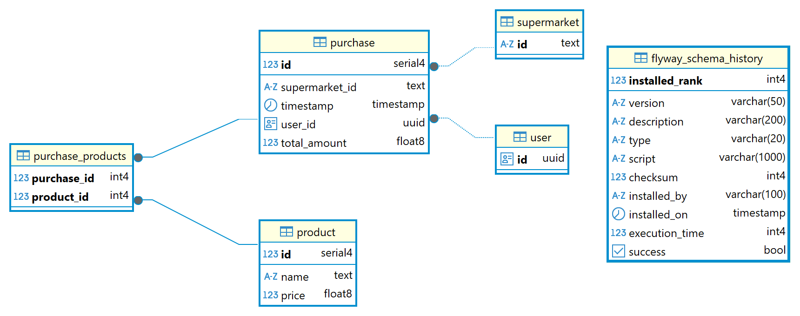

# iCash

### Running the application:

To run everything please use the following command:

```bash
docker-compose up --build
```

This spins up PostgreSQL on port 5432, `purchase-service` on port 8081 and `admin-service` on port 8082. Data will be loaded automatically via Flyway when the purchase service starts.

### APIs
For your convenience, you can use the following Swagger URLs for interacting with the services endpoint: 

Purchase-Service: http://localhost:8081/swagger-ui/index.html#/ <br>
    [-] Adding a new purchase 

Admin-Service: http://localhost:8082/swagger-ui/index.html#/ <br>
    [-] Get user count <br>
    [-] Get loyal users <br>
    [-] Get top selling products <br> 

### Architecture


One of the key considerations in designing this system was deciding the level of service separation. The initial dilemma was whether to break the system into multiple smaller services - such as having dedicated services for users, products, etc... - or to keep it more consolidated.

The trade-off was between increased flexibility and scalability by using many small microservices, versus added complexity in terms of data management and inter-service communication.

Eventually, we chose a simpler architecture with just two main services: `PurchaseService` for handling incoming purchases, and `AdminService` for analytics and reporting. This decision better fits the current scope and requirements of the system while avoiding unnecessary complexity.

### Database ERD:


